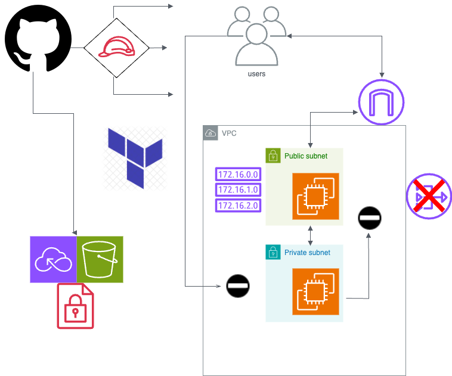

# Basic VPC deployment

Multi account strategy utilising terraform

## Triple workflow structure
- 
- 
- 

## Additional script to clear down Back end
- Custom python script to clear down backend (state for backend S3 dies with first workflow)

## Architecture

